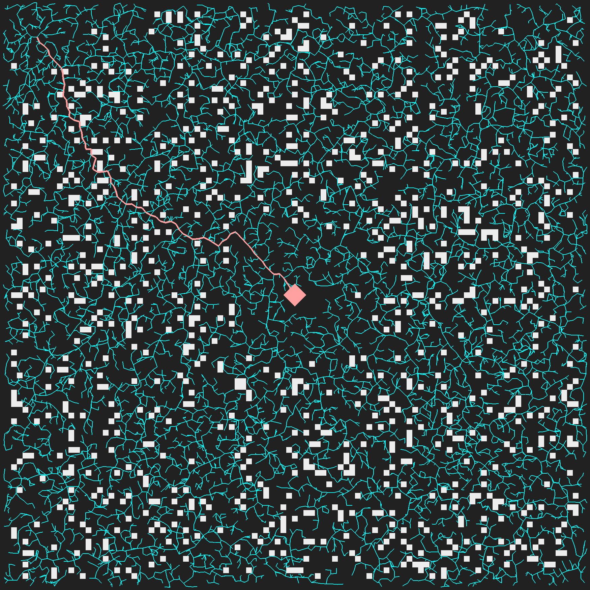

# RRT*

RRT* is a near-optimal pathfinding algorithm for motion planning in an obstacle-laden environment [1]. The problem 
being solved is distinct from more well-known graph search problems, like shortest-path searches, because we are not 
given an existing graph, only an open space possibly containing obstacles (i.e., the number of possible paths through 
the space approaches infinity). The idea behind rapidly-exploring random trees (RRT) is to iteratively explore the space
by building a tree of possible paths from a starting location. In each iteration, a random point in the space is chosen to be 
explored. From the closest vertex in the existing tree, one step is taken towards the randomly chosen point. The length 
of a step is given as a parameter and can be tuned for specific environments. When the goal is found, A* is used to determine the shortest path in the tree.

# Dependencies

This implementation uses the Boost Graph Library [2] to represent the tree and for graph algorithms. 
CGAL's [3] Delaunay_triangulation_2 is used for nearest neighbor queries. 
Box2d [4] is used for collision detection. 
SDL2/OpenGL [5] [6] are used for visualization.

[1] S. Karaman, M. R. Walter, A. Perez, E. Frazzoli and S. Teller, "Anytime Motion Planning using the RRT*," 2011 IEEE International Conference on Robotics and Automation, 2011, pp. 1478-1483, doi: 10.1109/ICRA.2011.5980479.

[2] https://www.boost.org/doc/libs/1_77_0/libs/graph/doc/index.html

[3] https://www.cgal.org/

[4] https://box2d.org/

[5] https://www.libsdl.org/

[6] https://www.opengl.org/